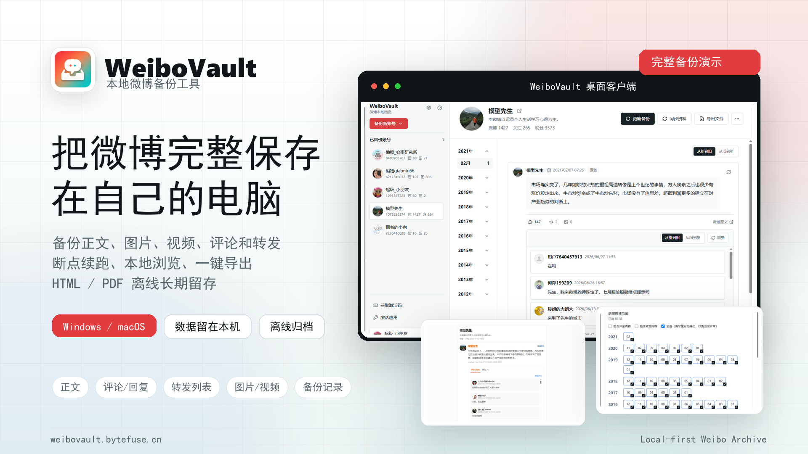
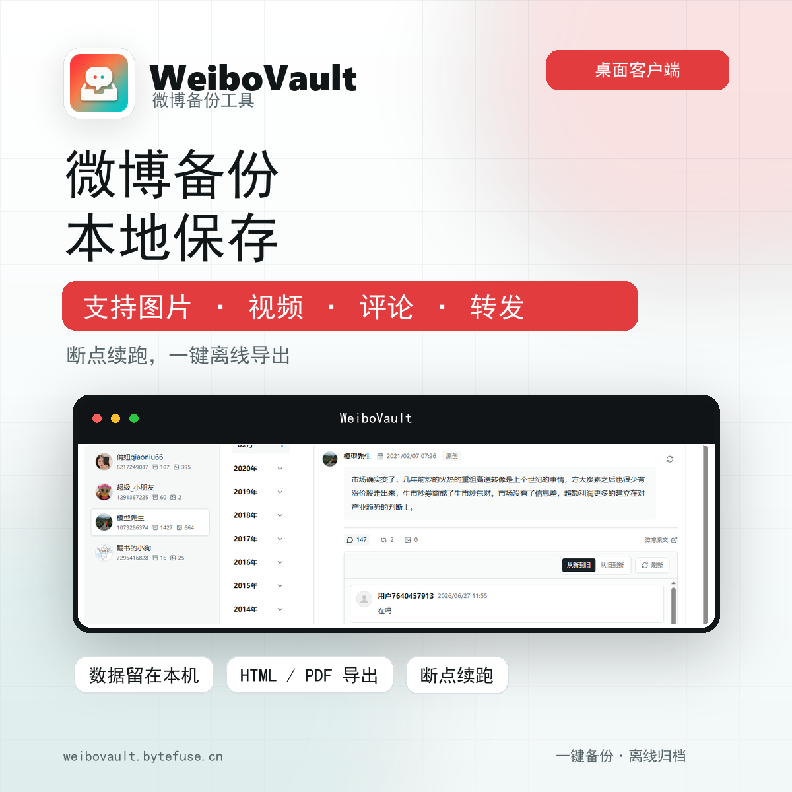
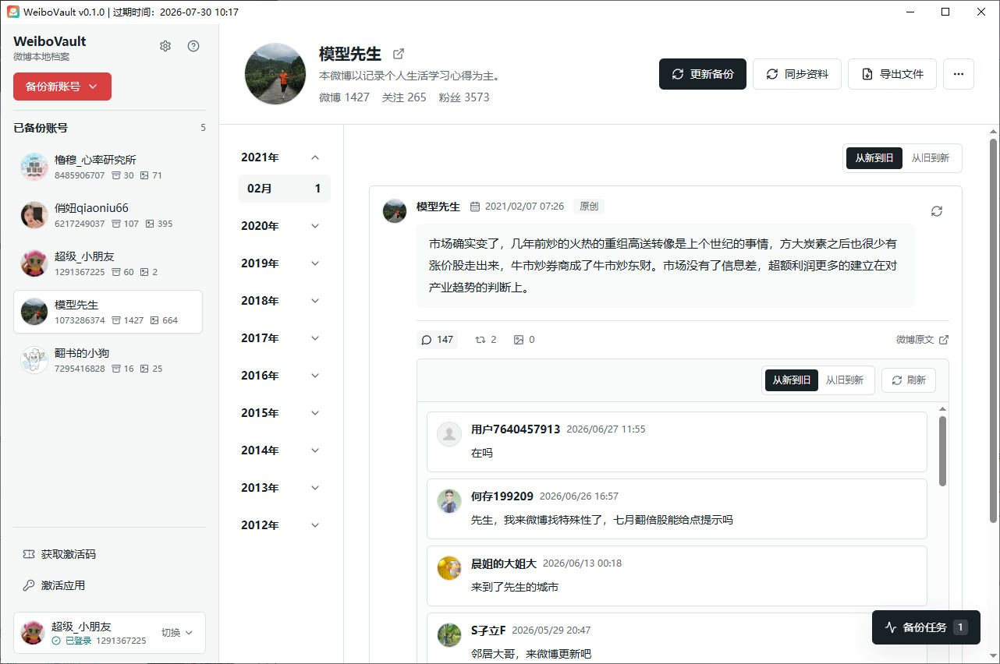
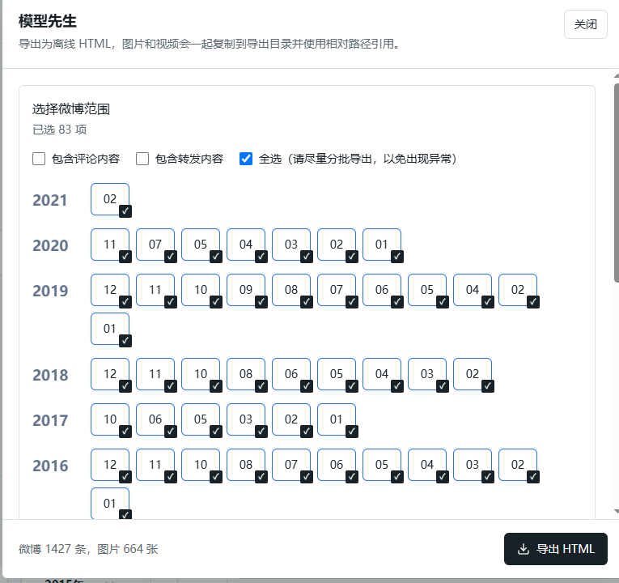
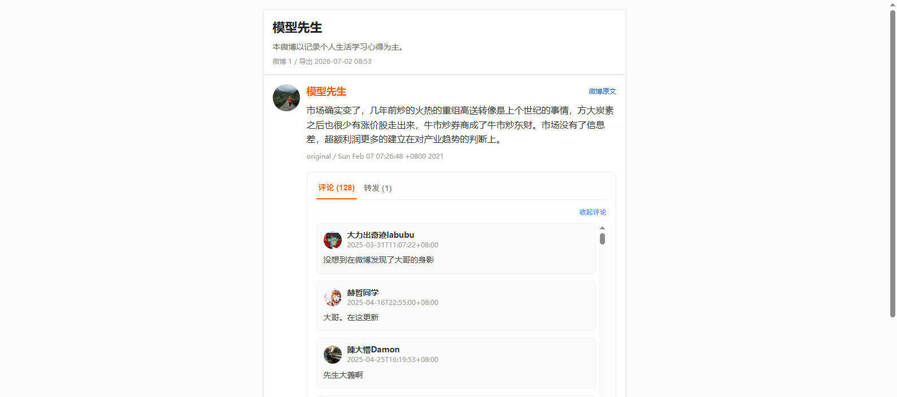

# WeiboVault ：微博备份 / 微博导出 / 评论转发备份

> WeiboVault 是一款面向个人微博内容归档的桌面备份工具。支持把微博正文、图片、视频、评论、回复、转发列表保存到本地，并导出为可离线查看的 HTML 或 PDF 文件。

官网与下载：[https://weibovault.bytefuse.cn/](https://weibovault.bytefuse.cn/)

## 这是什么

WeiboVault 不是通用爬虫框架，它更适合个人内容归档、账号迁移前备份、微博素材整理和离线留存。备份数据保存在本机，支持任务中断后继续执行，完成后可以在本地浏览，也可以导出为 HTML 或 PDF。

## 核心功能

- 备份自己的微博正文、发布时间和互动数据
- 备份其他可访问账号的公开微博内容
- 保存微博图片和视频到本地
- 备份评论、楼中楼回复和转发列表
- 支持任务暂停、失败后继续、断点续跑
- 支持本地浏览备份记录
- 支持导出离线 HTML 和 PDF 文件
- 支持 Windows 和 macOS 桌面客户端

## 适合这些需求

- 如何备份自己的微博到本地
- 如何导出微博内容、图片、视频
- 如何保存微博评论、回复和转发
- 微博账号迁移前如何保存历史内容
- 自媒体如何整理过去发布过的微博素材
- 如何把微博内容导出为 HTML 或 PDF 离线查看
- Weibo backup / Weibo archive / Weibo export

## 软件截图

## 推荐使用流程

1. 打开官网下载安装 WeiboVault 桌面客户端。
2. 使用微博账号登录，先创建一个小范围备份任务。
3. 按需要选择图片、视频、评论、回复、转发等备份范围。
4. 查看任务进度，确认可以暂停和继续。
5. 完成后在本地浏览备份记录，或导出 HTML / PDF 文件。

## 搜索关键词

微博备份、微博导出、微博归档、微博克隆、微博图片备份、微博视频备份、微博评论备份、微博回复备份、微博转发备份、微博 HTML 导出、微博 PDF 导出、微博本地备份、微博离线查看、个人微博备份、WeiboVault、Weibo backup、Weibo archive、Weibo export、Weibo downloader、Weibo comments backup、Weibo repost backup、Weibo HTML export。

## English

WeiboVault is a desktop tool for personal Weibo backup and local archiving. It helps users save Weibo posts, images, videos, comments, replies, repost lists, and backup records locally. Archives can be browsed on the desktop app and exported as offline HTML or PDF files.

Official website: [https://weibovault.bytefuse.cn/](https://weibovault.bytefuse.cn/)
